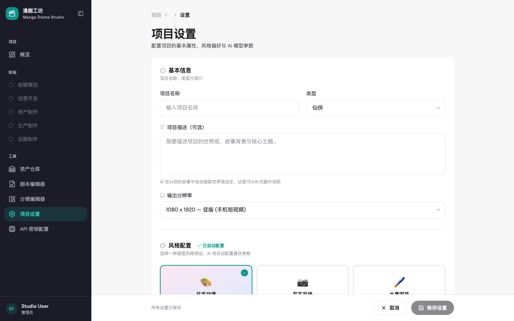
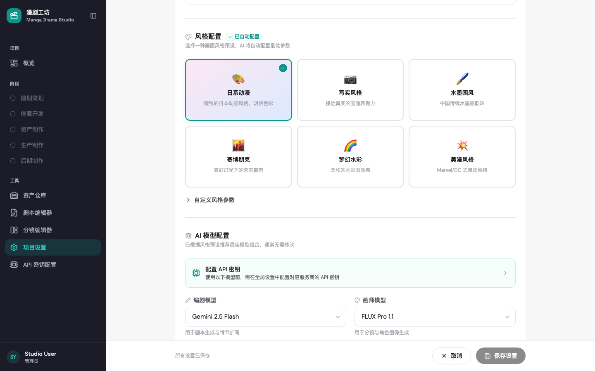
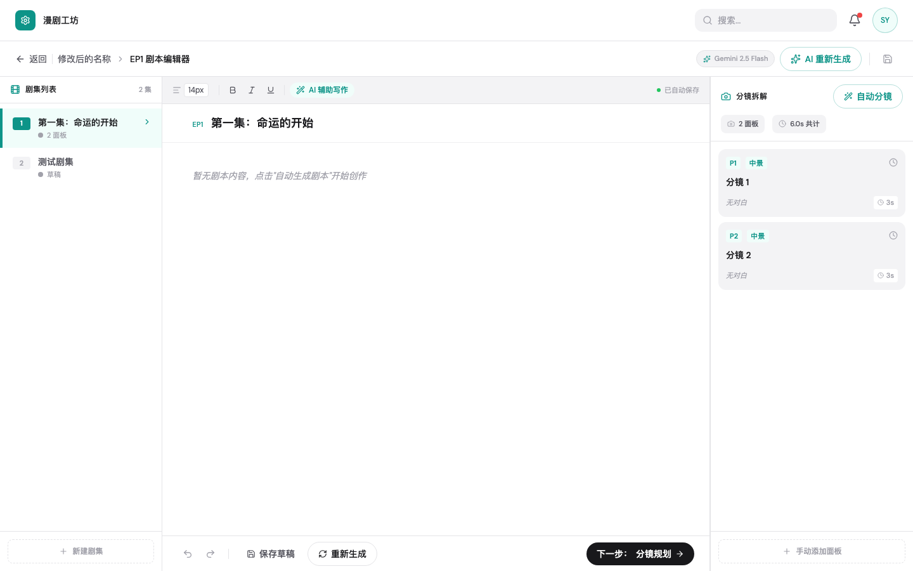
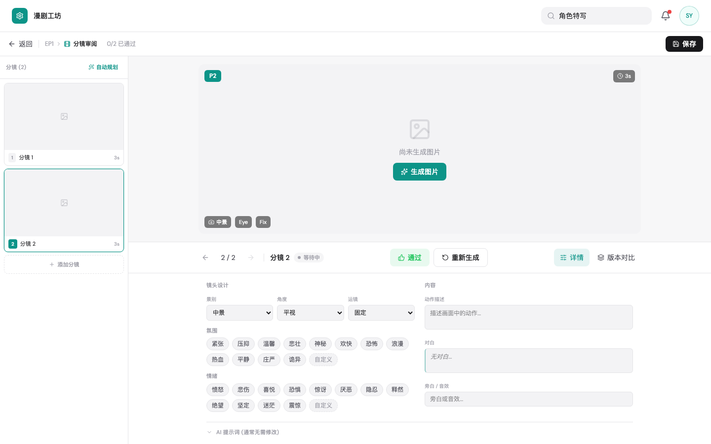
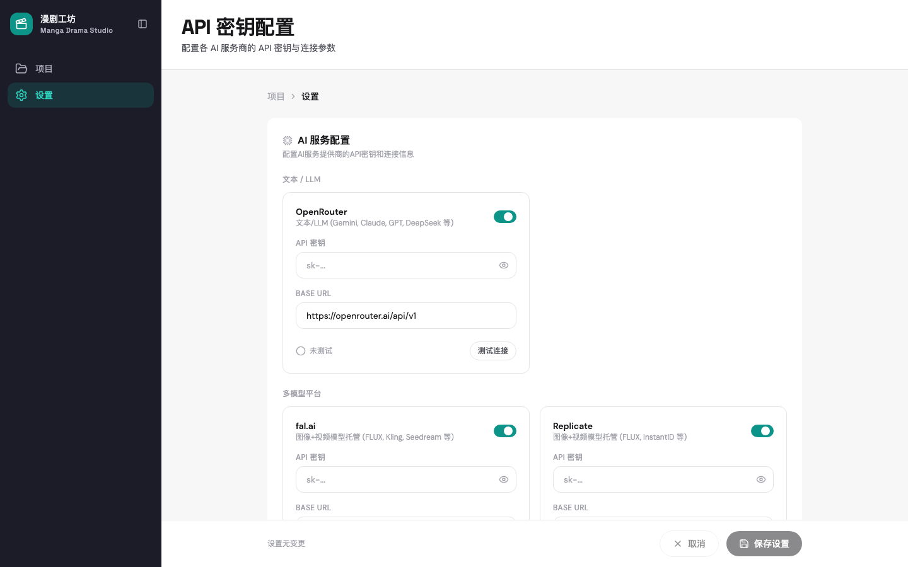

# Manga Drama Studio (漫剧工坊)

AI 驱动的漫剧/短剧全流程自动化制作平台。用户输入故事文本或创意简报，平台通过多个 AI Agent 协作，自动完成从前期设定、剧本撰写、分镜规划、图片/视频生成到最终成片的完整流程。

## 界面预览

### 项目设置 — 基本信息与输出配置

配置项目名称、类型、描述和输出分辨率。左侧导航展示完整的制作流水线阶段。



### 风格配置 — 视觉风格与 AI 模型选择

6 种预设视觉风格（日系动漫、写实风格、水墨国风、赛博朋克、梦幻水彩、美漫风格），搭配可配置的编剧模型和画师模型。



### 剧本编辑器 — 三栏布局的 AI 辅助写作

左栏剧集列表、中栏富文本编辑器（支持 AI 辅助写作）、右栏自动分镜拆解面板。



### 分镜编辑器 — 可视化分镜规划与审阅

左侧面板缩略图列表、中央画布预览区、底部镜头设计参数（景别/角度/运镜/氛围/情绪标签）。支持通过/驳回审阅流程。



### API 密钥配置 — 多 Provider 灵活接入

支持 OpenRouter（文本 LLM）、fal.ai 和 Replicate（图像/视频生成）等多个 AI 服务商，一处配置全局生效。



## 核心功能

- **项目管理** — 创建、配置和管理多个漫剧项目
- **资产仓库** — 角色、场景、道具的设定与管理
- **剧本编辑** — AI 辅助的剧本撰写与编辑，自动分镜拆解
- **分镜编排** — 可视化分镜规划、镜头设计参数、审阅流程
- **AI 生成** — 图片/视频/音频多 Provider 支持（OpenRouter、fal.ai、Replicate）
- **版本对比** — 不同版本的可视化对比

## 项目结构

```
manga-drama-studio/
├── packages/
│   ├── frontend/          # React + TypeScript + Tailwind CSS
│   └── backend/           # FastAPI + SQLAlchemy + LangGraph
├── docs/
│   └── PRD.md             # 产品需求文档
└── Makefile
```

## 技术栈

| 层级 | 技术 |
|------|------|
| 前端 | React 19, TypeScript, Tailwind CSS 4, React Router, TanStack Query, Zustand |
| 后端 | Python 3.12+, FastAPI, SQLAlchemy (async), LangGraph |
| 数据库 | SQLite (开发) / PostgreSQL (生产) |
| 任务队列 | arq + Redis |

## 快速开始

### 前置要求

- Node.js >= 18
- [uv](https://docs.astral.sh/uv/) (Python 包管理器)

### 安装依赖

```bash
make install
```

### 启动开发环境

```bash
make dev
```

前端默认运行在 `http://localhost:5173`，后端运行在 `http://localhost:8000`。

### 其他命令

```bash
make frontend    # 仅启动前端
make backend     # 仅启动后端
make build       # 构建前端生产包
make test        # 运行测试
make clean       # 清理构建产物
```

## 文档

详细的产品需求文档见 [docs/PRD.md](docs/PRD.md)。

## License

MIT
